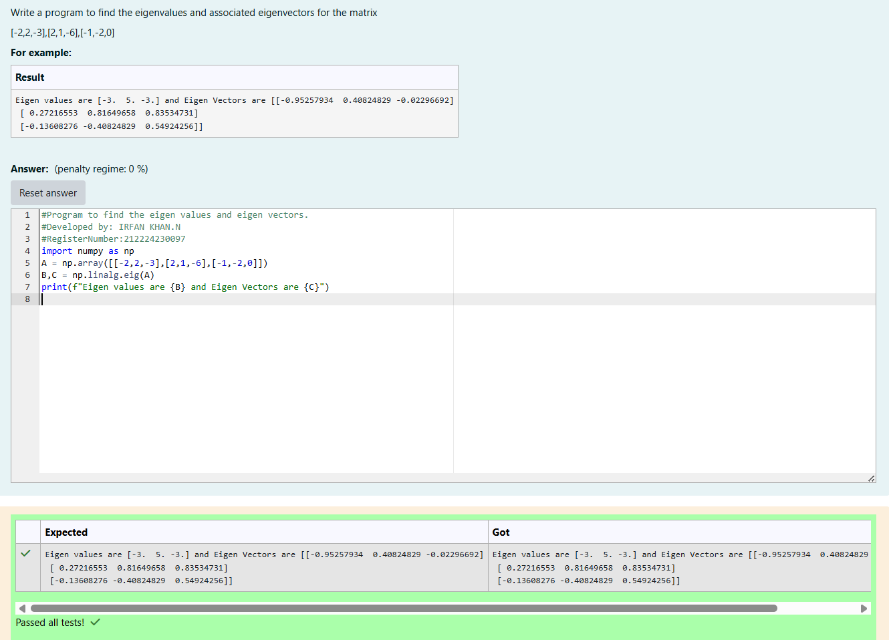

# EIGENVALUES-AND-EIGENVECTORS
## Aim:
To write a python program to find the Eigenvalues and Eigen Vectors
## Equipment’s required:
1. 	Hardware – PCs
2. 	Anaconda – Python 3.7 Installation / Moodle-Code Runner
## Algorithm:

### Step1 : Import the Required Library
### Step 2: Define the Matrix
### Step 3: Using the np.linalg.eig(), we get two results (first is eigenvalue and second is eigenvector) of the given matrix.
### Step 4: Display the Result 

## Program:
```
#Program to find the eigen values and eigen vectors.
#Developed by: kannan R
#RegisterNumber:212224240072
import numpy as np
A = np.array([[-2,2,-3],[2,1,-6],[-1,-2,0]])
B,C = np.linalg.eig(A)
print(f"Eigen values are {B} and Eigen Vectors are {C}")
```

## Output:

## Result:
Thus the Eigenvalue and Eigenvector is successfully solved using python program
